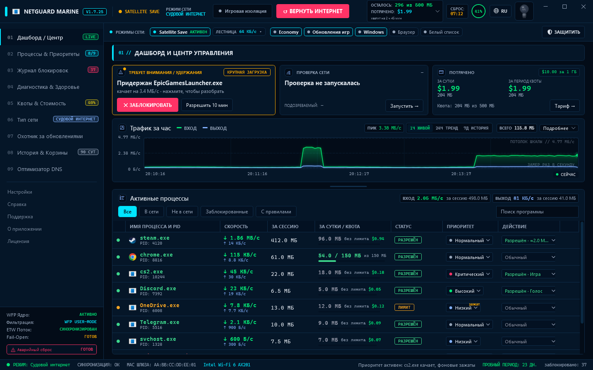
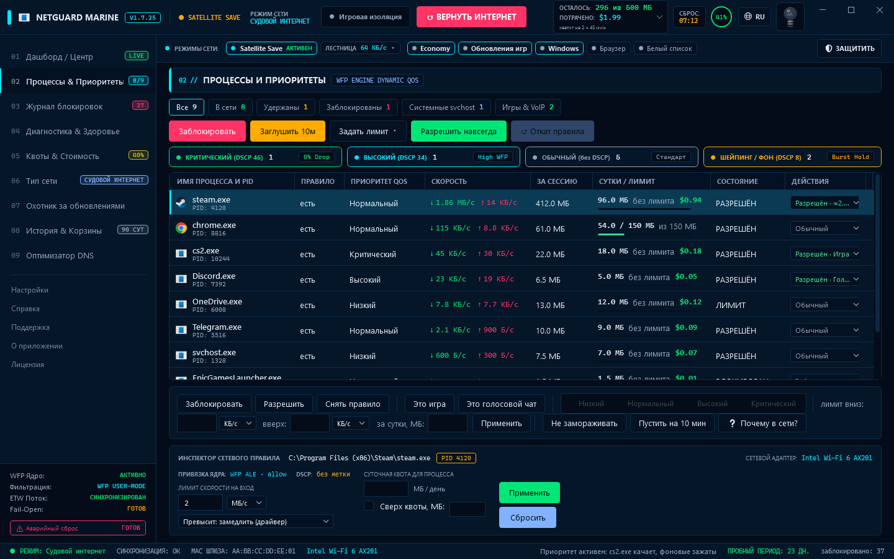
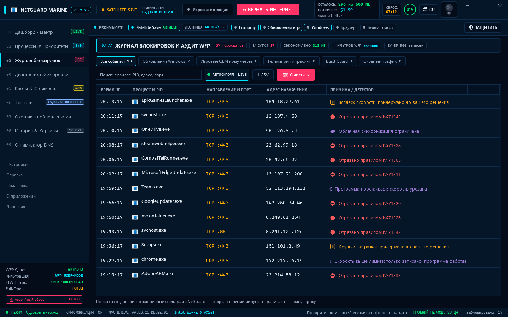
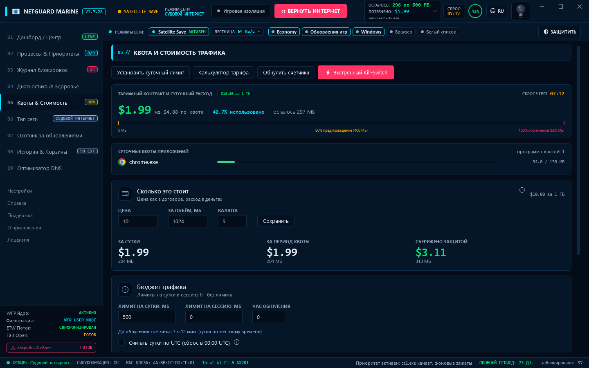
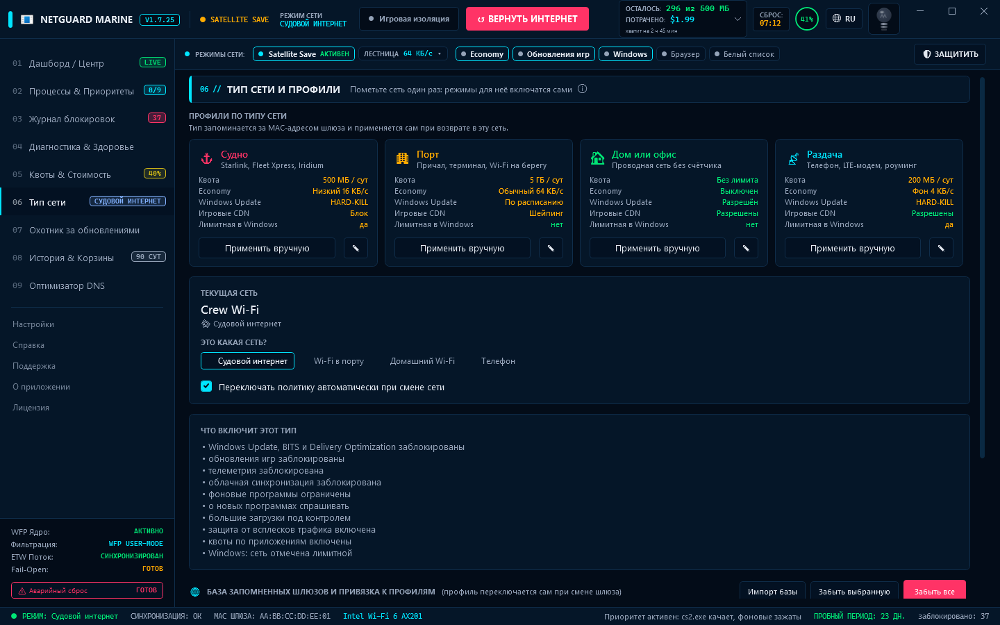
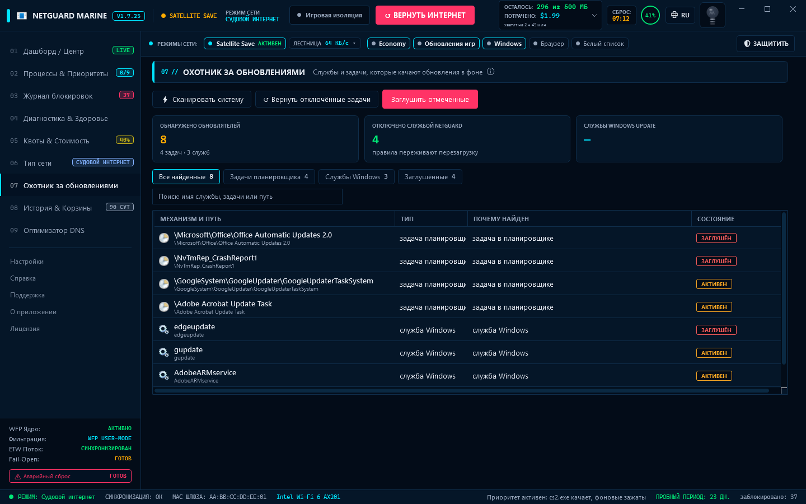
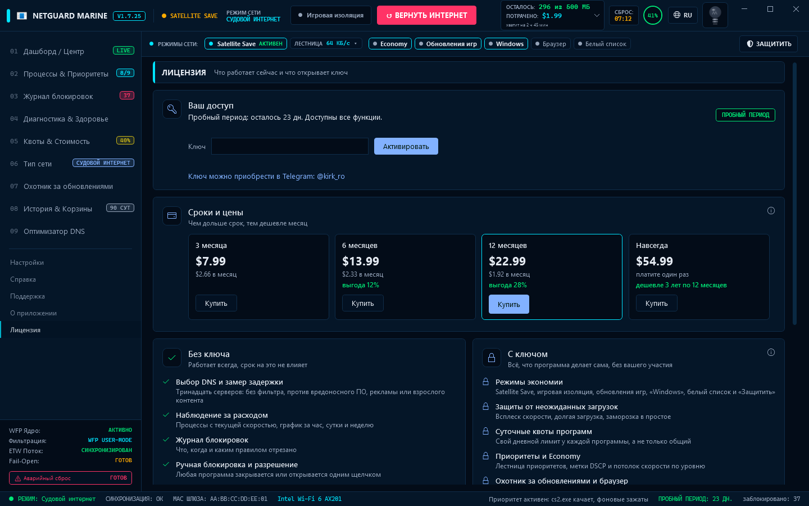
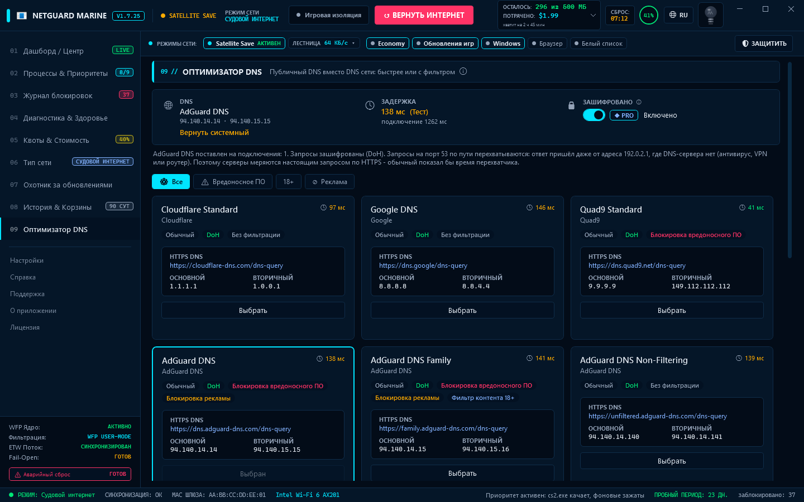
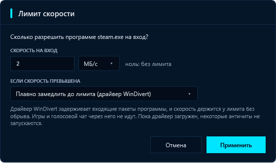

# NetGuard Marine

**Русский** · [English](README.en.md)

Контроль и жёсткое ограничение интернет-трафика для Windows. Сделано для лимитированных
каналов — спутник на судне, мобильный модем, тариф с оплатой за мегабайт.

Главная задача — **не дать трафику утечь незаметно**: фоновые обновления Windows,
телеметрия, Delivery Optimization, автозакачка патчей Steam/Epic/EA/Ubisoft, облачные
синхронизации. Программа блокирует **до** загрузки, а не считает потраченное после.

> Здесь лежат установщики NetGuard Marine и описания выпусков: они на странице
> [Releases](https://github.com/KirkRo/NetGuard-releases/releases). Код программы
> хранится в отдельном закрытом репозитории.



**[Скачать последнюю версию](https://github.com/KirkRo/NetGuard-releases/releases/latest)** ·
[Инструкция](#как-пользоваться) · [Возможности](#возможности) · [Экраны](#экраны) · [Безопасность](#безопасность) ·
[Команды](#команды)

---

## Установка

1. Скачайте `NetGuardSetup.exe` со страницы
   [Releases](https://github.com/KirkRo/NetGuard-releases/releases/latest).
2. Запустите его. Права администратора установщик попросит сам: без них Windows не даёт
   ставить фильтры трафика.
3. Прочитайте согласие на обработку данных компьютера. В нём перечислены признаки железа,
   по которым лицензия привязывается к машине, и сказано, где хранится их отпечаток и как
   его стереть. Без согласия установка не начнётся. При обновлении того, кто уже
   согласился, установщик не спрашивает снова, пока не изменился текст согласия
   (1.7.13 спросит один раз: текст уточнён).
4. Оставьте папку по умолчанию (`Program Files\NetGuard`) или выберите другую, в том числе
   на другом диске. Установщик выставит на неё права, чтобы программу нельзя было подменить.
5. Если галочка запуска оставлена, NetGuard откроется, когда вы закроете установщик.

**Обновление.** Раз в сутки NetGuard спрашивает GitHub, не вышла ли новая версия: один
запрос, около 10 КБ, выключается в «Настройках». Вышла — над экранами появляется плашка.
**Скачать и установить** качает установщик (около 3 МБ), сверяет его с подписанным
описанием выпуска и запускает; **Открыть GitHub** ведёт на страницу выпуска. Проверить
вручную — кнопка «Проверить сейчас» на экране «О приложении». Можно и по-старому: тот же
`NetGuardSetup.exe` новой версии поверх старой, в ту же папку. Лицензия, правила и
настройки сохраняются.

**Удаление** — «Параметры → Приложения» или `uninstall.exe` в папке установки. Удаление
снимает все фильтры, чистит `hosts`, возвращает службы Windows, задачи планировщика,
настройки браузеров и лимитный режим сетей Windows.

**Требования:** Windows 10 версии 1809 или новее, x64. Скачивать ничего не нужно:
.NET Framework 4.8 уже входит в Windows. Установщик весит меньше 3 МБ.

### Лицензия

**Пробный период — 30 дней** со всеми функциями, отсчёт с первого запуска. Дальше
программа продолжает работать в бесплатном режиме, а платные функции включаются ключом.
Ключ — в Telegram **@kirk_ro**.

| Срок ключа | Цена | В месяц |
|---|---|---|
| 3 месяца | $7.99 | $2.66 |
| 6 месяцев | $13.99 | $2.33 |
| 12 месяцев | $22.99 | $1.92 |
| Навсегда | $54.99 | один платёж |

Ключ, введённый до конца срока, прибавляет свой срок к оставшемуся. Один ключ на один
компьютер. Выданные раньше ключи на 30 дней работают.

Купить ключ можно прямо в программе: экран «Лицензия», «Купить» на карточке срока.
«Заказать в Telegram» откроет чат с продавцом, заказ уже будет набран. Присланный ключ
вставляется там же и сразу активируется. Цены и условия покупки на сайте:
[kirkro.github.io/NetGuard-releases/ru](https://kirkro.github.io/NetGuard-releases/ru/)
([по-английски](https://kirkro.github.io/NetGuard-releases/)). Оплата
картой, Apple Pay и Google Pay появится в программе, когда откроется магазин.

**Язык интерфейса** — русский или английский, кнопка RU/EN в шапке. На английский
переведены все экраны: шапка окна, девять основных экранов, «Настройки», «Справка»,
«Поддержка», «О приложении» с историей версий и «Лицензия», а также сообщения службы.
По-русски остаются окна при запуске, пока язык ещё не прочитан из настроек, и журнал службы.

| Без ключа | С ключом |
|---|---|
| Наблюдение за расходом | Режимы экономии (Satellite Save, игровая изоляция, белый список) |
| Журнал блокировок | Защиты от неожиданных загрузок |
| Ручная блокировка и разрешение | Суточные квоты программ |
| Ограничение скорости программы | Приоритеты и Economy |
| Общая суточная квота | Охотник за обновлениями и экономия в браузере |
| Тип сети | Диагностика и здоровье правил |
| История за неделю | Расчёт стоимости трафика |
| Аварийный сброс | Профили сетей и автопереключение |
| Возврат отключённых задач | История дольше недели |
| Выбор DNS и замер задержки | Зашифрованный DNS (DoH) |

Лицензия привязана к компьютеру: удаление и повторная установка не начинают пробный
период заново и не отнимают купленные дни.

`NetGuard.FreeDemo.exe` из того же выпуска — программа, которая всегда в бесплатном
режиме: чтобы посмотреть, что входит в платный доступ.

---

## Как пользоваться

### 1. Укажите, в какой вы сети

Экран **06 Тип сети**. Выберите: судовой интернет, Wi-Fi в порту, домашний Wi-Fi или
телефон. Каждый тип — готовый набор правил: на судне обновления Windows отрезаны и
действует суточная норма 500 МБ, дома ограничений нет. Метка запоминается за MAC-адресом
шлюза, и при возвращении в эту сеть профиль включится сам.

На судовом интернете и телефоне NetGuard ещё и включает в Windows лимитное подключение:
Windows Update откладывает необязательные загрузки, программы Microsoft экономят сами.
Сеть, которую вы уже сделали лимитной, не трогается; прежнее значение возвращается, когда
тип сети меняется. Выключается галочкой в «Настройках» → «Сети».

Карандаш на карточке профиля меняет его квоту, потолок скорости и отношение к обновлениям.

### 2. Задайте тариф и квоту

Экран **05 Квоты и стоимость**. Цена вводится так, как написано в договоре — например,
«10 за 1024 МБ». После этого расход показывается в деньгах: за сутки и за период квоты.
Суточный лимит в мегабайтах предупреждает на 80 % и 90 %, а при исчерпании может
отключить интернет — это **kill-switch**.

### 3. Включите экономию

Кнопка **SATELLITE SAVE** в шапке включает всё сразу: Windows Update, BITS, Delivery
Optimization, обновления игр, телеметрию и облачные синхронизации. Отдельные режимы — в
строке «Режимы сети» под шапкой. **ЗАЩИТИТЬ** справа применяет защиту под текущий тип сети.

### 4. Настройте отдельные программы

Экран **02 Процессы и приоритеты** или таблица на дашборде. У каждой строки есть меню
**«Действие»**:

| Пункт | Что делает |
|---|---|
| Разрешить / Заблокировать / Обычный | Доступ программы в сеть |
| Это игра / Это голосовой чат | Отметка: автоматика такую программу не трогает и не замедляет |
| Лимит скорости… | Потолок в КБ/с или МБ/с и что делать при превышении |
| Снять правило | Вернуть программу к поведению по умолчанию |

В закрытом виде меню показывает, что с программой сейчас: `Разрешён · Игра · ≤2.0 МБ/с`.

Приоритет (Низкий → Критический) решает, кто уступает канал: пока занята программа
выше, те, что ниже, урезаются по исходящей скорости.

### 5. Лимит скорости: три реакции

| Реакция | Что происходит |
|---|---|
| **Записать и не мешать** (по умолчанию) | Превышение появляется в журнале, программа работает |
| **Отсекать** | При каждом превышении программа отключается на 10 секунд. Соединения рвутся |
| **Замедлить (драйвер)** | Драйвер WinDivert держит скорость у лимита без обрыва |

Замедление включается галочкой в **Настройках** («Плавно замедлять входящую скорость»).
Драйвер загружается, только пока есть кого замедлять, и сразу выгружается. Игры и
голосовой чат через него не идут. Некоторые античиты (FACEIT, Vanguard) не запускаются,
пока драйвер загружен, — перед такой игрой снимите галочку.

### 6. Смотрите, что было заблокировано

Экран **03 Журнал блокировок** — кто, куда и почему. Фильтры по роду причин, поиск,
выгрузка в CSV. Красное — отрезано правилом, янтарное — придержано защитой и ждёт вашего
решения, синее — ограничено, но работает.

### 7. Найдите обновлятели

Экран **07 Охотник за обновлениями** → «Сканировать систему». Находит службы, задачи
планировщика и программы, которые качают обновления в фоне. Ничего не меняет, пока вы не
отметите и не нажмёте «Заглушить отмеченные». «Вернуть отключённые задачи» откатывает всё.

### 8. Выберите DNS

Экран **09 Оптимизатор DNS**. Вверху — какой DNS стоит сейчас, его задержка и шифрование.
Ниже — тринадцать публичных серверов; вкладки «Вредоносное ПО», «18+» и «Реклама»
оставляют те, что это отсекают. «Выбрать» ставит сервер на подключения, через которые идёт
трафик; «Вернуть системный» возвращает DNS, который стоял раньше.

**(Тест)** меряет задержку текущего DNS и всех серверов списка — только по нажатию. Каждый
сервер получает настоящий DNS-запрос по HTTPS (DoH, HTTP/2): около 6 КБ на сервер, около
80 КБ за весь список. Задержка — время запроса по открытому соединению; время подключения
(на спутнике — до секунды) показано под ней и в подсказке у каждого сервера. Самый быстрый
отмечен звездой. Короткий запрос по UDP здесь лгал бы: антивирус, VPN, роутер или судовой
терминал перехватывают его и отвечают из своего кеша за 1–3 мс. Если сеть так делает,
экран об этом пишет.

**Зашифровано** (по ключу, Windows 11) переводит запросы к выбранному серверу на DNS over
HTTPS: их не подслушать и не подменить. На открытый UDP они не откатываются — если сервер
недоступен по HTTPS, выключите шифрование или нажмите «Вернуть интернет». Перед включением
каждый адрес сервера проверяется по HTTPS: адрес, который в этой сети занят чем-то другим,
пока включено шифрование, не используется; не ответил ни один — шифрование не включается.

### Если пропал интернет

Сначала — красная кнопка **ВЕРНУТЬ ИНТЕРНЕТ** в шапке. Если окно не открывается,
в PowerShell от имени администратора:

```powershell
& "C:\Program Files\NetGuard\NetGuard.exe" --purge
```

Эта команда снимает все фильтры, чистит `hosts`, удаляет политики QoS, возвращает
службы Windows, лимитный режим сетей и DNS, стоявший до NetGuard, и выгружает драйвер. Работает, даже когда
сети нет совсем.

Кроме того, фильтры живут столько же, сколько служба: если она упадёт, интернет вернётся
сам.

---

## Экраны

Снимки сделаны из настоящего окна программы с вымышленными данными — имена, адреса и
сети придуманы.

### Процессы и приоритеты

Таблица всех программ с правилами, приоритетами и суточными лимитами. Снизу — инспектор
выбранной программы: здесь Steam замедляется драйвером до 2 МБ/с.



### Журнал блокировок



### Квота и стоимость



### Тип сети и профили



### Охотник за обновлениями



### Лицензия



### Оптимизатор DNS



### Окно лимита скорости



---

## Возможности

**Блокировка до загрузки**
- Windows Update, BITS, Delivery Optimization и телеметрия — остановка служб и блок по
  **SID службы**, а не по `svchost.exe` целиком (иначе пропали бы DNS и DHCP).
- CDN лаунчеров Steam/Epic/EA/Ubisoft: игры и матчмейкинг работают, патчи не качаются.
- Домены обновлений — через свой блок в файле `hosts`.
- Облачные синхронизации — блок или ручеёк скорости.

**Режимы**
- **Satellite Save** — максимальная экономия одной кнопкой.
- **Игровая изоляция** — сеть только у игры и отмеченных программ.
- **Строгий белый список** — запрещено всё, кроме разрешённого.
- **Economy** — потолок исходящей скорости по приоритету.

**Защиты от неожиданного расхода**
- Всплеск скорости и крупная загрузка — программа придерживается до вашего решения.
- Заморозка по простою — давно не используемая программа урезается, потом отключается.
- Детектор фоновых утечек — кто передаёт, пока им не пользуются.
- Аномалии — расход, непохожий на обычный для этой программы.
- Неучтённый трафик — адаптер намерил больше, чем объясняют программы.

**Учёт и деньги**
- Суточная квота с предупреждениями и kill-switch; квоты на отдельные программы.
- Расход в деньгах по вашему тарифу; «сбережено защитой» — только по измеренному.
- История: 90 дней по суткам и 8 суток по часам; график за час, сутки и неделю.

**Сети**
- Четыре профиля: судно, порт, дом, раздача. Опознание по MAC шлюза и автопереключение.
- Лимитное подключение Windows на судне и телефоне, с возвратом прежнего значения.

**DNS**
- Оптимизатор DNS: тринадцать публичных серверов с фильтром по задаче — без фильтрации,
  против вредоносного ПО, рекламы или взрослого контента.
- Замер задержки по кнопке и зашифрованный DNS (DoH) по ключу.
- Прежний DNS возвращается кнопкой, при удалении и в «Вернуть интернет».

**Диагностика**
- Проверка связи: десять проверок и один названный подозреваемый — **без единого пакета
  в сеть**.
- Здоровье правил: сломанные, истёкшие, конфликтующие и забытые правила.
- Автооткат: если после новой блокировки пропала связь, NetGuard предложит её отменить.

**Честность**
- Программа не ходит в сеть сама: ни проверки лицензии, ни телеметрии. Исключение одно:
  раз в сутки она спрашивает GitHub, не вышла ли новая версия. Это около 10 КБ, и проверка
  выключается в «Настройках».
- Всё, что меняет в системе, она запоминает и возвращает при удалении.

---

## Ограничение скорости: что честно, а что нет

**Исходящий трафик** ограничивается политикой QoS Windows — настоящий шейпинг в ядре.
Economy и приоритеты работают именно так и соединений не рвут.

**Входящий трафик** Windows из обычной программы замедлять не даёт: фильтр WFP
срабатывает при установлении соединения, и вердикта «помедленнее» у него нет. Поэтому
у лимита на вход три реакции (см. [выше](#5-лимит-скорости-три-реакции)):

- по умолчанию превышение только записывается;
- «отсекать» рвёт соединения — это ваш выбор для конкретной программы, автоматика так
  не делает;
- «замедлить» работает через драйвер **WinDivert**: он задерживает входящие пакеты, и
  TCP сам сбавляет скорость. Замедляется только TCP, поэтому браузерный QUIC (UDP) им не
  замедляется.

До версии 1.7 автоматика отсекала программы сама, и игры с лаунчерами рвались каждые
десять секунд. Это исправлено: отсекает только то, что вы назвали отсечкой.

---

## Безопасность

- **Фильтры исчезают вместе со службой.** Сессия WFP динамическая: если служба упадёт
  или её убьют, все фильтры снимаются автоматически и интернет возвращается. На судне
  «фильтр завис, связи нет совсем» — худший исход, чем утечка нескольких мегабайт.
- **Управляющий канал закрыт.** Named pipe доступен только `SYSTEM` и группе
  «Администраторы». Неэлевированный процесс не может его даже открыть — иначе любая
  программа могла бы отключить машине сеть.
- **Файл `hosts` правится только внутри своих маркеров** `# >>> NetGuard` /
  `# <<< NetGuard`. Всё, что написали вы или другие программы, не трогается, а при
  удалении блок вычищается целиком.
- **Режимы запуска служб Windows запоминаются** до изменения и восстанавливаются при
  выключении режима или удалении программы.
- **Драйвер WinDivert** из официального релиза
  ([basil00/WinDivert](https://github.com/basil00/WinDivert)), с подписью Microsoft. Его
  файлы сверяются с записанными контрольными суммами.
- **Обновление ставится только подписанное.** Скачанный установщик запускается, только
  если его размер и SHA-256 совпали с описанием выпуска, подписанным ключом RSA-3072, а
  версия новее установленной. Закрытый ключ хранится у автора и в репозиторий не
  попадает: даже угнанная учётная запись GitHub не заставит программу поставить чужой
  файл. Скачивание — только по кнопке.

---

## Команды

| Команда | Действие |
|---|---|
| `NetGuard.exe` | Открыть интерфейс |
| `NetGuard.exe --install` | Установить и запустить службу |
| `NetGuard.exe --uninstall` | Удалить службу и снять все ограничения |
| `NetGuard.exe --purge` | **Аварийно** снять все фильтры и вернуть сеть |
| `NetGuard.exe --status` | Показать состояние службы |
| `NetGuard.exe --background on\|off` | Работать в фоне или только пока открыто окно |
| `NetGuard.exe --restore-tasks` | Включить обратно задачи планировщика |
| `NetGuard.exe --reset-guards` | Вернуть пороги защит по умолчанию |
| `NetGuard.exe --shaper-check` | Проверить драйвер WinDivert: загрузить и выгрузить, без трафика |
| `NetGuard.exe --metered-status` | Показать, считает ли Windows текущую сеть лимитной (только чтение) |
| `NetGuard.exe --console` | Запустить движок в консоли (отладка) |
| `NetGuard.exe --diag-appid <exe>` | Разобрать, почему правило не срабатывает |

NetGuard всегда работает с правами администратора — Windows спросит разрешение при
запуске. Команды запускайте из PowerShell от имени администратора.
